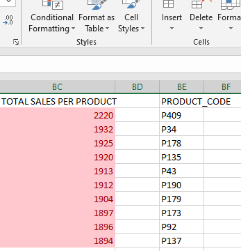
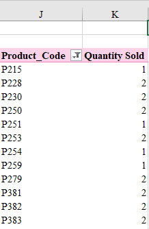
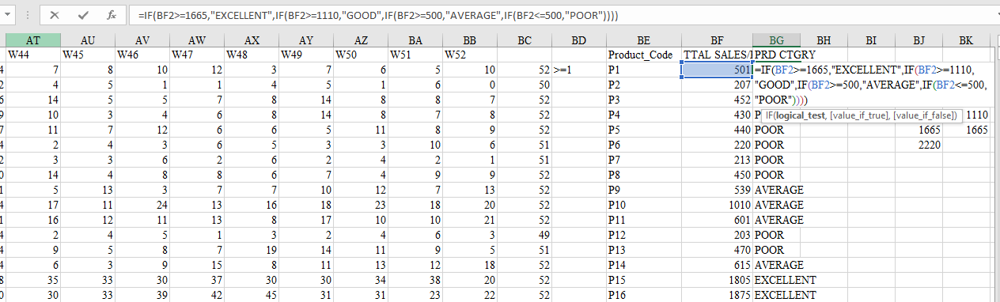
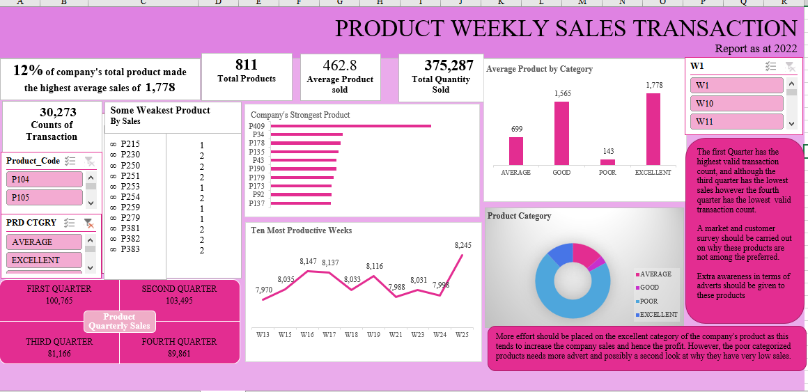

# PRODUCTS WEEKLY SALES TRANSACTION
## INTRODUCTON
This is an excel project on product analysis for an imaginary company in the year 2022. The project is to analyze and derive insights to answer crucial questions and help the company to make data driven decision for the product sold. This is a dataset downladed from kaggle to demonstrate capabilities of excel.

## SKILLS DEMONSTRATED
Filtering, Formula functions, Conditional Formatting, Pivot table, Chart, Dashboard

## PROBLEM STATEMENT
1. Total quantity of product sold in the year
2. Average sales of product
3. Top ten product with highest quantity sold
4. Ten productive weeks of the year
5. Products with very insignificant sales in the year

## ANALYSIS
The company has a total of 811 products and sold 375,287 quantity all through the year with an average of 463 products sold. Excel formula function was used to carry out this operation.

The company’s most effective product sold about 2220 quantity in the year. 
Some product made as little as 1 sale all through the year 
Conditional formatting was used to achieve the high-yielding and lowest sold product list for the company. 

Top ten high-yielding products          |   least productive products
:--------------------------------------:|:----------------------------:
                    |         

The products were categorised into four segments using the IF statement

 

Some of the productive weeks of the year and the quantity of product sold was determined. The year was quarterly divided and the first quarter of the year has the highest quantity of product sold.

## CONCLUSION AND RECOMMENDATION
The category with the highest product is the 'poor' with total number of 578 product unable to sell at least 500 product yearly. In addition, first Quarter has the highest valid transaction, and although the third quarter has the lowest sales, the fourth quarter has the lowest valid transaction count. 

### RECOMMENDATION
The poorly categorized products needs extra awareness in terms of advert and possibly a second look at why they have very low sales all through the year. A customer survey on why they are not preferred in the market could also be carried out. 

